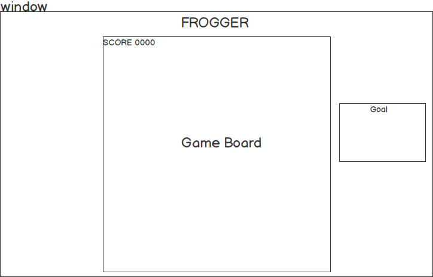

## Frogger

### Background

Frogger is a fast paced arcade game where a frog using player directions tries to get from one end of the screen to the other without hitting other moving objects. Objects will move on their own and it is up to the player to figure out how to get the frog to it's destination.

### Functionality & MVP  

With this Frogger clone, users will be able to:

- [ ] Start and Reset the game board
- [ ] Move the frog up, down, left, right

In addition, this project will include:

- [ ] An About modal describing how to move and what the goal is
- [ ] A production Readme

### Wireframes

This app will consist of a single screen with game board and nav links to the Github, my LinkedIn,
and the About modal.  Game controls will include Start and Reset buttons.  

### Architecture and Technologies

This project will be implemented with the following technologies:

- Vanilla JavaScript and `jquery` for game logic,
- `Easel.js` with `HTML5 Canvas` for DOM manipulation and rendering,
- Webpack to bundle and serve up the various scripts,
- React for rendering a modal,
- Babel for transpiling ES6 to ES5.

In addition to the webpack entry file, there will be three scripts involved in this project:

`board.js`: handle logic for creating and updating the necessary `Easel.js` elements and rendering them to the DOM.

`game.js`: take in user input and check if the player has won or lost

`mover.js`: frog and other moving objects logic

### Implementation Timeline

**Day 1**: Setup all necessary Node modules, including getting webpack up and running and `Easel.js` installed.  Create `webpack.config.js` as well as `package.json`.  Create starting entry file and scripts.  Figure out how to create something using `Easel.js`.

- Get a green bundle with `webpack`
- Learn enough `Easel.js` to render an object to the `Canvas` element

**Day 2**: Continue learning how to use `Easel.js`, more in depth. Create a mover with `mover.js` and place it on a board in `board.js`.

- Complete the `mover.js` module (constructor, update functions)
- Render a square grid to the `Canvas` using `Easel.js`

**Day 3**: Create logic and rendering for moving objects on the board.

- Make objects movable

**Day 4**: Install the user interaction controls.  Make the frontend look nice.

- Allow up, down, left, right with keyboard arrow keys
- Create a splash page

### Bonus features

- [ ] High Score List
- [ ] Different terrains like logs on water.
